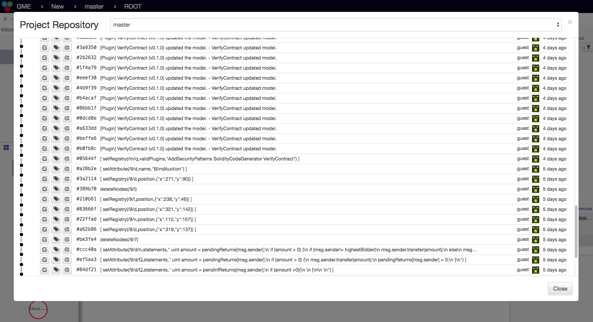
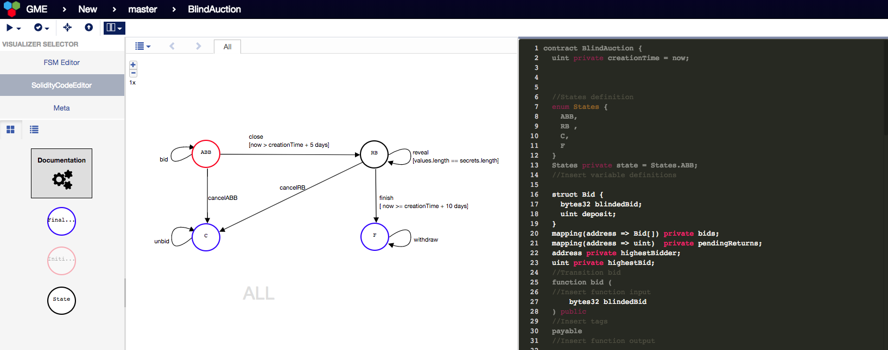
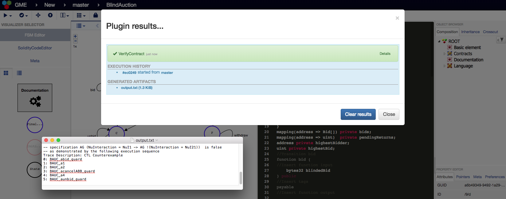

# Correct-by-Design Smart Contracts: FSolidM / VeriSolid Framework

This repository contains the implementation of the FSolidM / VeriSolid framework, which allows designing and generating secure Solidity smart contracts. FSolidM / VeriSolid is built on [WebGME](http://github.com/webgme/webgme). A hosted version of FSolidM is available online on [CPS-VO](http://cps-vo.org/group/SmartContracts) for non-commercial and academic use.

## Contents
1. [What is FSolidM?](#what-is-fsolidm)
2. [How to install FSolidM?](#how-to-install-fsolidm)
3. [Features of FSolidM](#features)

## What is FSolidM?
The adoption of blockchain-based distributed computation platforms is growing fast. Some of these platforms, such as Ethereum, provide support for implementing smart contracts, which are envisioned to have novel applications in a broad range of areas, including finance and Internet-of-Things. However, a significant number of smart contracts deployed in practice suffer from security vulnerabilities, which enable malicious users to steal assets from a contract or to cause damage. Vulnerabilities present a serious issue since contracts may handle financial assets of considerable value, and contract bugs are non-fixable by design.

To help developers create more secure smart contracts, we introduce FSolidM, a framework rooted in rigorous semantics for designing contracts as Finite State Machines (FSM). We present a design studio for creating FSMs on an easy-to-use graphical interface and for automatically generating Ethereum contracts. We have integrated in FSolidM a set of design patterns, which we implement as plugins that developers can easily add to their contracts to enhance security and functionality.

## How to install FSolidM?
First, install the following:
- [NodeJS](https://nodejs.org/en/download/) (v4.x.x recommended)
- [MongoDB](https://www.mongodb.com/download-center#production)

On Ubuntu, you also need to install `npm` and `nodes-legacy` using `apt`.

To clone the repository, first install (if necessary):
- [Git](https://git-scm.com/downloads)

and then clone the repository in your preferred directory, for example:
```
cd /home/$USER
git clone https://github.com/anmavrid/smart-contracts.git
```
This makes the 'project root' for the git repo `/home/$USER/smart-contracts`.

Install packages with npm in the project root (`smart-contracts`):
```
cd /home/$USER/smart-contracts
npm install
npm install webgme
npm install -g bower
bower install
```
Start mongodb locally by running the `mongod` executable in your mongodb installation (you may need to create a `data` directory or set `--dbpath`). For example:
```
cd /home/$USER
mkdir sc_data
mongod --dbpath ./sc_data
```
wait until you see a line that says "[initandlisten] waiting for connections on port 27017".

Then, in a new terminal window, run `npm start` from the project root (`smart-contracts`) to start. For example:
```
cd /home/$USER/smart-contracts
npm start
```

After the webgme server is up and there are no error messages in the console, open a valid address in the browser to start using the Smart Contracts. The default is http://127.0.0.1:8888/, you should see all valid addresses in the console.

Click `Create New…` to create a new project.
After entering a project name of your choice, import the seed `SC` to start working on smart contracts!

IMPORTANT: To use the VerifyContract plugin, please download the nuXmv tool (version 1.1.1) from https://es-static.fbk.eu/tools/nuxmv/index.php?n=Download.Download and just add it in the smart-contracts/verificationTools folder.

## Features

* Collaborative, automatically versioned web-based development.



* Dedicated Transition System Editors. In the upper left corner you can see the plugins offered by the tool for: 1) adding functionality through design patterns; 2) generating Solidity code and 3) verifying smart contracts.


* Fully integrated Solidity code development.



* Templates for writing security properties in natural language when running the VerifyContract plugin. If no property is specified the tool still verifies deadlock-freedom. 


* The verification results are returned to the user. If a security property is not true, FSolidM returns a counter-example that invalidates the property.



* Embeddable documentation at every level of the model.

